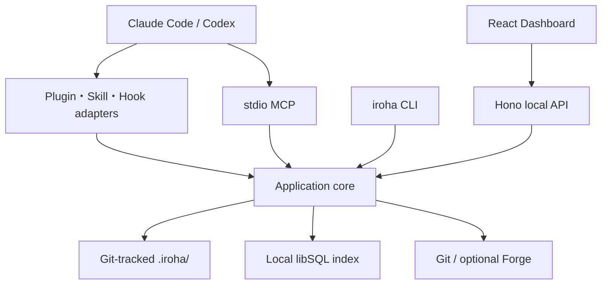
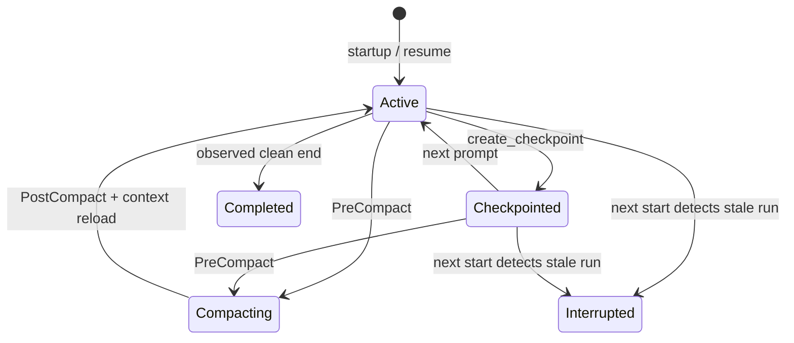

# iroha — Design

> Status: Implementation Baseline v1  
> Updated: 2026-07-18  
> Requirements: [requirements.md](./requirements.md)

## 1. この文書の役割

この文書はirohaの全体アーキテクチャ、責務境界、主要データフロー、技術判断を定義する。実装時の厳密なfield、timeout、SQL、HTTP endpointは、次の責務別contractを正本とする。

| Concern | Authoritative contract |
|---|---|
| 実装者への指示 | [CLAUDE.md](./CLAUDE.md) / [AGENTS.md](./AGENTS.md) |
| Runtime、version、OS、package構成 | [Compatibility Contract](./implementation/compatibility.md) |
| `.iroha/`形式と承認transaction | [Canonical Data Contract](./implementation/canonical-schema.md) |
| DB、search、rebuild | [Database Contract](./implementation/database-schema.md) |
| MCP tool | [MCP Contract](./implementation/mcp-contract.md) |
| Claude Code/Codex Hook | [Hook Contract](./implementation/hooks-contract.md) |
| Dashboard/API | [Dashboard/API Contract](./implementation/dashboard-api.md) |
| End-to-end受け入れ | [First Vertical Slice](./implementation/vertical-slice.md) |
| 実装順序 | [Implementation Plan](./implementation/implementation-plan.md) |
| 確定判断 | [Decision Log](./implementation/decision-log.md) |
| Machine contract | [schemas/](./schemas/) / [migration v1](./migrations/001_initial.sql) |

矛盾がある場合は、machine contract、責務別contract、本書、requirements、backgroundの順に優先する。仕様を変更する場合は、Decision Logと影響するcontract・fixtureを同じ変更で更新する。

## 2. アーキテクチャ概要

irohaは、Git管理される承認済み知識と、ローカルの操作・検索状態を明確に分離する。



レイヤーごとの責務は次の通り。

- **Canonical layer**: 人間承認済みで、チーム共有される正本。
- **Local operational layer**: Session、Run、Turn、Candidate、検索index、vector、cursor。DBは再構築可能だが、未承認データ削除は失われ得る。
- **Platform adapter layer**: Claude Code/Codex固有input/outputを共通eventへ変換する。
- **Agent interface layer**: Skill、Hook context、MCP retrieval/Checkpoint。承認権限は持たない。
- **Human control plane**: CLIとlocalhost Dashboard。Candidateの編集・承認・却下を担当する。

## 3. Technology baseline

| Area | Decision |
|---|---|
| Runtime | Node.js `>=24.0.0 <25` |
| Language | TypeScript 7、strict、ESM-only |
| Workspace | pnpm 11.14.0 + Turborepo 2.10.5、単一lockfile |
| Published package | `@iroha-labs/iroha`、binaryは`iroha` |
| Dashboard | React 19.2.7 + Vite 8.1.5 SPA |
| Local API | Hono 4.12.30、same-origin、loopback only |
| Validation | Zod 4 + JSON Schema 2020-12 |
| Database | local libSQL、Raw SQL、ORMなし |
| Search | FTS5 `unicode61` + `trigram`、任意のlibSQL vector |
| Embedding | 任意のVoyage `voyage-4`、1024次元 |
| Graph | `relations` table + bounded recursive CTE |
| Test | Vitest、Playwright、contract fixtures |
| Build | tsdown Node bundle、Vite static assets |

依存versionは自動追従せず、[Compatibility Contract](./implementation/compatibility.md) の固定baselineと`pnpm-lock.yaml`を使用する。

## 4. Repository and package boundaries

目標treeは [Implementation Plan](./implementation/implementation-plan.md) を正本とする。主要package責務は次の通り。

| Package | Responsibility |
|---|---|
| `@iroha/domain` | 型付きID、entity、state transition、pure policy |
| `@iroha/config` | shared/local config schema |
| `@iroha/canonical` | Markdown/YAML parse、validate、deterministic publish |
| `@iroha/storage` | libSQL connection、migration、repository |
| `@iroha/search` | FTS、vector adapter、hybrid ranking |
| `@iroha/git` | Git identity、ref、diff metadata |
| `@iroha/forge` | Forge provider port |
| `@iroha/forge-github` | 最初のP1 provider |
| `@iroha/platform` | normalized Hook contract |
| `@iroha/adapter-claude` | Claude Hook mapping/output |
| `@iroha/adapter-codex` | Codex Hook mapping/output |
| `@iroha/core` | use case、transaction、authorization boundary |
| `@iroha/mcp` | stdio MCP transport/tool |
| `@iroha/api` | local Hono API/auth/static serving |
| `@iroha/cli` | `iroha` command |
| `@iroha/plugin` | manifests、Hooks、Skills、packaged artifact |
| `apps/dashboard` | React SPA。generated API client以外のserver packageへ依存しない |

`domain`はstorage、adapter、CLI、API、UIへ依存しない。workspace cycleは禁止する。初期公開packageは`@iroha-labs/iroha`だけとし、内部packageはprivateにする。

## 5. Plugin and process model

### Naming and invocation

| Capability | Claude Code | Codex | CLI |
|---|---|---|---|
| Init | `/iroha:init` | `$iroha:init` | `iroha init` |
| Sync | `/iroha:sync` | `$iroha:sync` | `iroha sync` |
| Search | `/iroha:search` | `$iroha:search` | `iroha search` |
| Checkpoint | `/iroha:checkpoint` | `$iroha:checkpoint` | `iroha checkpoint` |
| Dashboard | `/iroha:dashboard` | `$iroha:dashboard` | `iroha dashboard` |
| Doctor | `/iroha:doctor` | `$iroha:doctor` | `iroha doctor` |

Claude CodeとCodexは別manifestと別Hook configを持ち、Skill sourceとbundleを共有する。Plugin installation lifecycle scriptには依存しない。永続データをPlugin installation directoryへ書かない。

v0.1に常駐daemonはない。Hookは短命process、MCPはagent host管理のstdio process、Dashboard APIは`iroha dashboard`の存続中だけ動く。

## 6. Source of truth and local state

### Canonical data

`.iroha/`には次だけを保存する。

- 承認済みSession Summary
- 承認済みDecision、Rule、Concept、Insight、Incident、Pattern、Review Learning
- shared config、taxonomy、provenance、relation

pending/rejected Candidate、raw prompt/transcript、Embedding、token、local path、Forge cursorは保存しない。厳密なpath、frontmatter、body templateは [Canonical Data Contract](./implementation/canonical-schema.md) と [canonical JSON Schema](./schemas/canonical-v1.schema.json) を使用する。

### Local data

Git commandで解決した次の場所を使用する。

```text
<git rev-parse --git-path iroha>/
├── index.db
├── local-config.json
├── locks/
├── dirty/
├── logs/
└── hook-outputs/
```

Git内部pathを文字列連結で推測しない。linked worktree、非ASCII path、Windows path、symlink escapeをcontract test対象とする。

## 7. Database design

DDLの正本は [001_initial.sql](./migrations/001_initial.sql) である。migrationはlibSQLで実行検証済みで、forward-onlyとする。

| Group | Tables |
|---|---|
| Schema / identity | `schema_migrations`, `repositories`, `actors`, `entities`, `canonical_documents` |
| Session | `agent_sessions`, `session_runs`, `turns`, `tool_events`, `checkpoints` |
| Development | `work_items`, `commits`, `pull_requests`, `review_comments`, `files`, `symbols` |
| Knowledge | `knowledge_items`, `candidates`, `approvals` |
| Graph / search | `relations`, `search_documents`, `search_fts_unicode`, `search_fts_trigram`, `embeddings_1024`, `embedding_jobs` |
| Operations | `sync_cursors`, `dirty_markers`, `local_settings`, `event_log`, `idempotency_keys`, `session_tokens` |

主要原則:

- `entities`がgraph/searchの共通identity、typed tableが詳細を持つ。
- foreign keyを常時有効化し、WAL、短いwrite transaction、2.5秒busy timeoutを使う。
- `schema_migrations`はchecksumを保持し、適用済みSQL変更をhard errorにする。
- approved canonicalはauthority 100、verified Git/Forge 80、Checkpoint 60、Candidate 30を基準とする。
- Agent向け検索からpending/rejected Candidateを除外する。
- MCP/HTTP mutationは`idempotency_keys`で再試行しても重複を作らない。

DB削除は承認済み知識を失わないが、未承認Candidateやlocal Session detailを失い得る。UI/CLIはこの差を明示する。

## 8. Session and Hook lifecycle



`Agent Session`は継続可能なplatform thread、`Session Run`は1回の起動/再開区間、`Turn`はuser prompt単位である。resumeは同じSessionに新しいRunを作る。

P0 Hook:

1. `SessionStart`: stale Run回復、session mapping、changed-file sync、承認済みcontext注入。
2. `UserPromptSubmit`: Turn作成、raw promptを保存せずHMAC digest、local retrieval。
3. `PreToolUse`: allowlisted target抽出、承認済みGuardrailだけを決定的に評価。
4. `PostToolUse`: status/target/digestを保存し、意味ある変更ならCheckpoint pending。
5. `PreCompact` / `PostCompact`: state flush、dirty marker、承認済みcontext再注入。
6. `Stop`: Checkpoint不足時に最大1回だけ継続要求。transcriptは解析しない。
7. Claude `SessionEnd`: status更新だけ。Codex correctnessは終了Hookへ依存しない。

Hook内でEmbedding/Forge remote call、full rebuild、canonical publish、summary生成を行わない。timeout/DB busy時は原則fail-openとし、厳格な強制はCIと組み合わせる。

## 9. MCP and approval boundary

stdio MCP serverは次を提供する。

- `search`
- `get_context`
- `get_active_rules`
- `get_session_state`
- `get_relations`
- `create_checkpoint`
- `propose_knowledge`
- `link_entities`

Agentは検索とlocal Candidate作成だけを行える。approve、reject、canonical edit、Guardrail activation、delete/export、privacy設定変更はMCPへ公開しない。

Hookが発行する256-bit session tokenはrepository、Session、Run、platformへbindし、DBにはHMACだけを保存する。MCP mutationはtokenとidempotency keyを要求する。Checkpoint inputは [checkpoint JSON Schema](./schemas/checkpoint-v1.schema.json) で固定する。

## 10. Human approval and publishing

```mermaid
sequenceDiagram
    participant A as Agent
    participant D as Local DB
    participant H as Human
    participant G as Git worktree
    A->>D: Checkpoint / Candidate
    H->>D: Review and edit
    H->>G: Approve → atomic canonical write
    H->>D: Update entity/index/audit
    Note over G,D: DB failure leaves dirty marker; next sync repairs from Git
```

承認の固定順序:

1. repository write lock取得
2. Candidate revision token再検査
3. Schema、body template、secret、path validation
4. sibling temporary fileへdeterministic serialize
5. flush、atomic rename、可能ならparent fsync
6. DB entity/relation/search/audit transaction
7. 失敗時はdirty markerを残して次回syncで修復

Session Summaryは1 Agent Sessionにつき1 canonical documentとし、追加Runや修正は新しいCandidateの再承認でrevisionを増やす。v0.1は自動公開しない。

## 11. Search and context design

検索documentはtitle、body、code terms、authority、provenanceから作る。

- `unicode61`: 英語、一般語、code identifier
- `trigram`: 日本語/CJK、substring
- `F32_BLOB(1024)`: 任意のVoyage vector
- `relations`: Issue/file/symbol/PRとの近接性

candidate generationは各indexのtop 30を取得し、RRFで融合する。authority、同一symbol/path、active Issue/PR、graph distanceをbounded multiplierで加味し、recencyは最大5%のtie-breakerにする。正確な式と評価thresholdは [Database Contract](./implementation/database-schema.md) を正本とする。

Embedding未設定・失敗時はFTS+Graphへdegradeする。Hookはremote query embeddingを行わず、深いsemantic searchはMCP/CLI/Dashboardから明示的に実行する。

Hook contextは最大8,000文字・12 items。ID、短い要約、関連理由、authority、sourceを含め、全文は明示検索時だけ返す。

## 12. Sync and rebuild

`iroha sync`:

1. schema version確認
2. canonical manifest/hash比較
3. changed documentのparse/validate
4. entity/relation/search documentをtransactional upsert
5. Git metadata更新
6. Embedding job queue更新

`iroha sync --rebuild`は新しいsibling DBへ全migrationとimportを行い、integrity check成功後だけatomic replaceする。Canonical parse/schema errorがあれば現DBを置き換えない。compatible vectorはcontent hashで再利用できる。

Forge failureはcanonical/Git syncを失敗させない。GitHubはP1、GitLabはv0.1ではprovider port/fixtureだけとする。

## 13. Dashboard and Local API

`iroha dashboard`はrandom portの`127.0.0.1`へHonoをbindし、built SPAと`/api/v1`をsame-origin配信する。

認証:

1. 起動ごとに256-bit launch token生成
2. URL fragmentでbrowserへ一度だけ渡す
3. `/api/auth/exchange`でHttpOnly/SameSite=Strict cookieへ交換
4. fragmentを履歴から除去
5. mutationはcookie、exact Origin、JSON Content-Type、`X-Iroha-Request: 1`を要求

Initial UI:

- Overview
- Sessions / Runs / Turns / Checkpoints
- Candidate Review Queue
- Knowledge
- Search
- Work Graph
- Settings / Doctor

raw conversation endpoint、個人ranking、生産性scoreは作らない。Realtimeは不要で、mutation後invalidateとvisible pageの5秒pollingだけを使用する。WebSocket/SSEは使わない。

## 14. Privacy and security

保存禁止またはcanonical公開禁止:

- raw prompt/transcript/assistant message/reasoning trace
- full tool input/output
- plaintext session token、credential、API key
- credential入りremote URL
- 個人評価score

すべての境界でvalidationするが、raw platform Hook inputだけは将来fieldを許容し、既知必須fieldを厳格に検査する。canonical、normalized event、MCP/API inputはunknown fieldを拒否する。

relative pathはrealpath後にrepository内であることを検証する。shell commandは文字列連結せずargument arrayを使う。Dashboardはloopbackだけにbindし、arbitrary shell実行APIを持たない。

Guardrailは完全なsecurity boundaryではない。決定的に判定できる承認済みspecだけをHookで評価し、timeout/internal failure時はfail-openする。release、secret、branch policy等のhard enforcementはCI/permission/branch protectionへ置く。

## 15. Failure and recovery

| Failure | Required behavior |
|---|---|
| `.iroha/`未初期化 | Hook no-op、CLI/Skillでinit案内 |
| DB unavailable/busy | Agent処理を不要に止めずtyped diagnostic |
| schema mismatch | writeを止め、read-only doctor/migration案内 |
| Embedding failure | FTS-onlyへdegrade、job retry |
| Forge failure | canonical/Git sync継続 |
| canonical write後のDB failure | dirty marker、次回sync修復 |
| Git conflict | semantic auto-mergeしない |
| abrupt exit | 次回SessionStartでstale Runをinterruptedへ |
| Hook disabled/untrusted | CLI/Skill/MCP fallbackとdoctor案内 |
| stale API revision token | HTTP 409、silent merge禁止 |

## 16. Verification strategy

| Level | Required coverage |
|---|---|
| Unit | ID、state transition、ranking、redaction、serializer |
| Schema | JSON Schema/Zod equivalence、positive/negative fixtures |
| Contract | Claude/Codex Hook、MCP、API、Forge fixtures |
| DB | migration、constraint、FTS、vector capability、integrity、rebuild |
| Integration | init → Hook → Checkpoint → approve → sync |
| E2E | Dashboard publish、Plugin smoke、teammate pull/rebuild |
| Compatibility | Tier 1 OS、worktree、非ASCII/path space、CRLF |
| Performance | 10k entity、Hook p95、search evaluation 60 queries |

最初のend-to-end判定は [First Vertical Slice](./implementation/vertical-slice.md) を使用する。実装は [Implementation Plan](./implementation/implementation-plan.md) のWP-00から順に進める。

## 17. Architecture Decision Record summary

| ADR | Decision | Status |
|---|---|---|
| ADR-001 | Product/plugin/CLI nameは`iroha` | Accepted |
| ADR-002 | 1 repository、Claude/Codex別manifest | Accepted |
| ADR-003 | TypeScript + Node 24 + pnpm/Turbo、ESM-only | Accepted |
| ADR-004 | React + Vite Dashboard、Next.js不採用 | Accepted |
| ADR-005 | Hono same-origin local server | Accepted |
| ADR-006 | Git-tracked `.iroha/`がshared canonical | Accepted |
| ADR-007 | libSQLはlocal operational index | Accepted |
| ADR-008 | Raw SQL、ORMなし、relational graph | Accepted |
| ADR-009 | FTS5 + optional vector + RRF | Accepted |
| ADR-010 | Turn Checkpoint。SessionEnd依存なし | Accepted |
| ADR-011 | Human approval before canonical publish | Accepted |
| ADR-012 | Advisory ruleとGuardrailを分離 | Accepted |
| ADR-013 | No cloud、no daemon、no realtime | Accepted |
| ADR-014 | No transcript core dependency、no surveillance | Accepted |
| ADR-015 | scoped npm `@iroha-labs/iroha` | Accepted |

Public licenseの選択だけは初回release前のdecision gateであり、local implementationを止めない。
